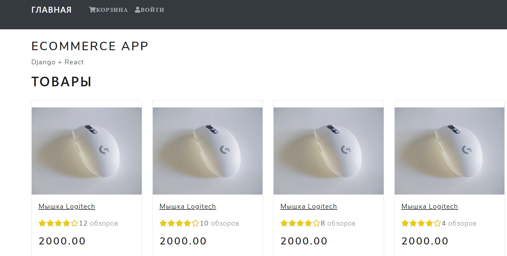
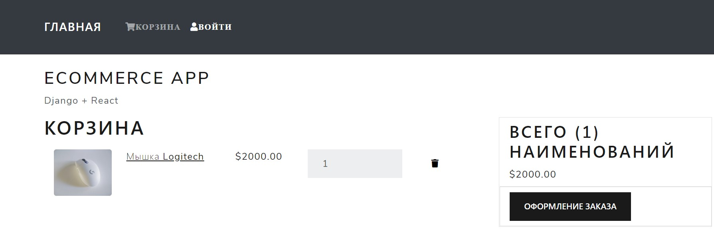
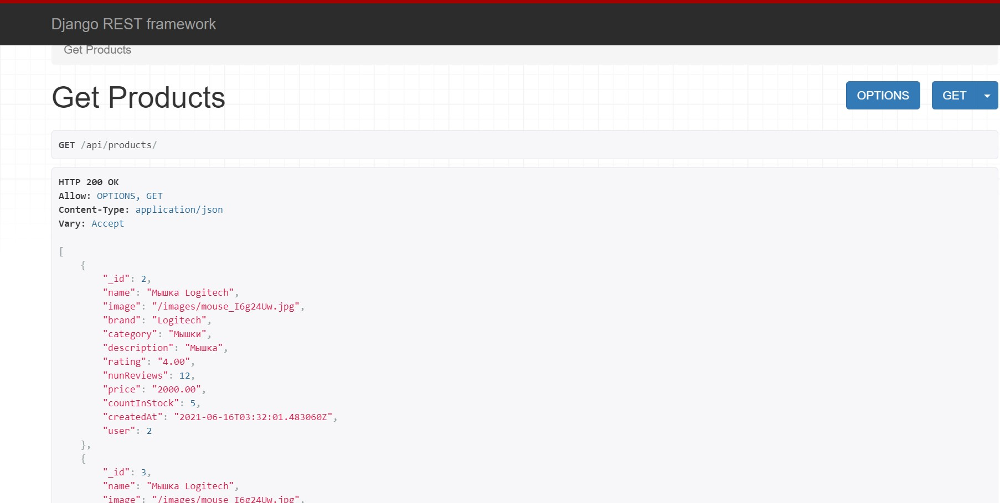
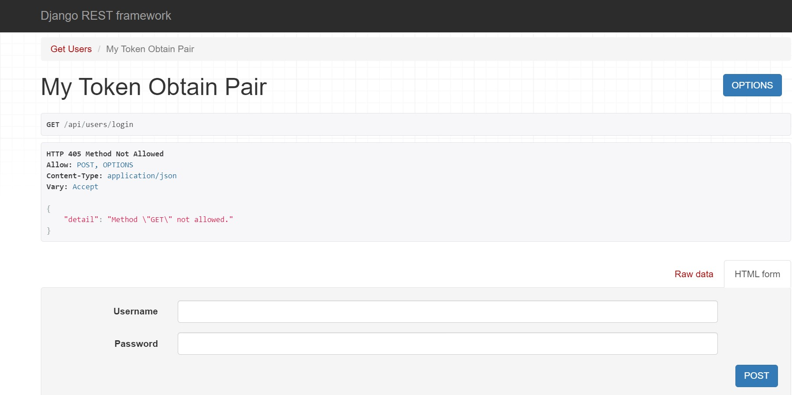

# Ecommerce

## Проект с бэкендом на Django (DRF) и React.js

## Особенности

- Маршруты API для получения данных с бэкенда
- JWT-токены для авторизации
- Миграции для базы данных
- Использование Redux для управления состоянием

## Технологии

В проекте использованы технологии:

- Django - Python-фреймворк бэкенда
- Django Rest Framework - API
- React.js - фреймворк для SPA
- Redux - state management
- Bootstrap - UI компоненты для приложения

## Установка

Запуск приложения Django

```sh
cd backend
python manage.py start
```

Для сборки фронтенда и запуска React-приложения

```sh
cd frontend
npm install
npm run dev 
```

## Скриншоты





